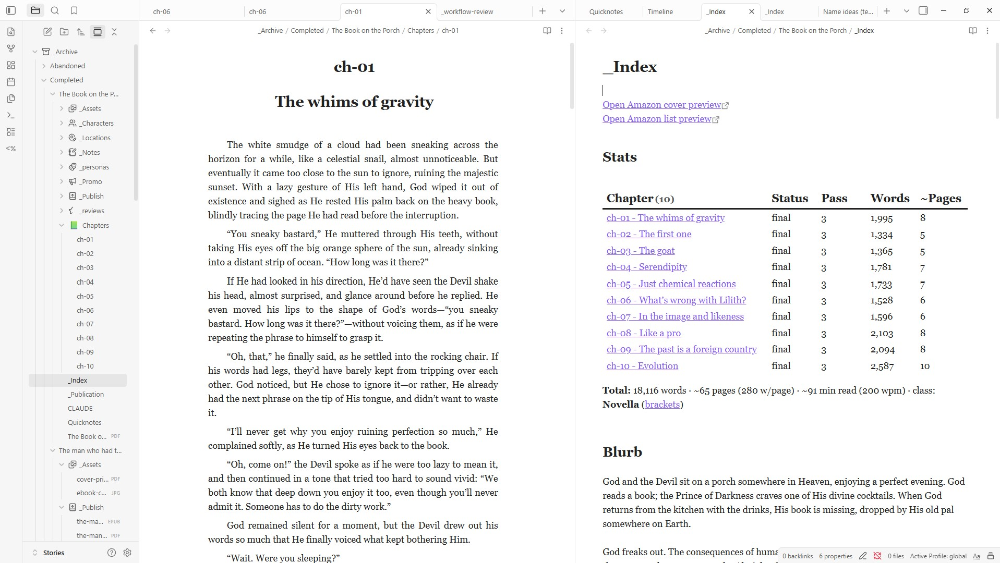
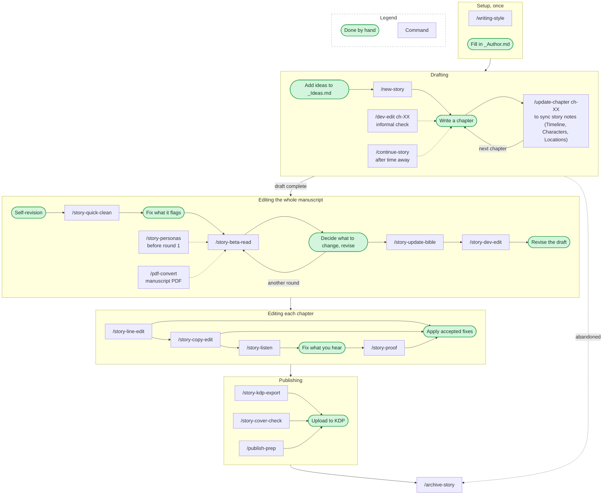
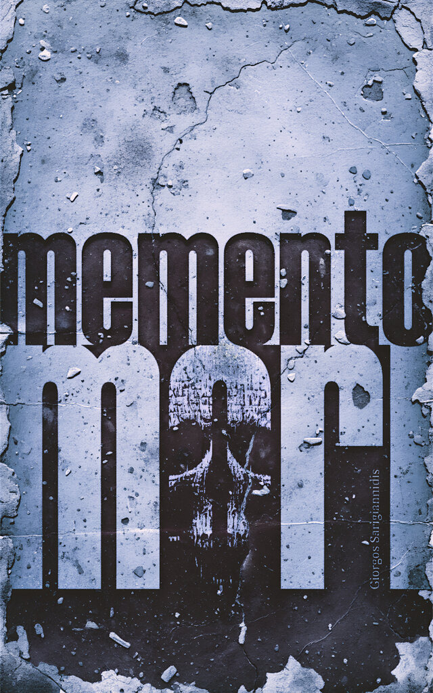

# Publishing House

**A publishing house in a vault.**

I write as a hobby, on my weekends and days off, and I don't want to spend what little time I have on peripheral tasks instead of the writing itself. So I asked myself: if I had an unlimited budget to hire a team around me, what specialties would I need? Developmental editors, line editors, copy editors, proofreaders, beta readers, a production department for the print and ebook files. This repo is my attempt to emulate that team, packaged as an [Obsidian](https://obsidian.md) vault wired for [Claude Code](https://claude.com/claude-code). The idea is simple: you write the fiction; the house does everything else, from your first note to the files you upload to Amazon KDP.

One principle runs through the whole system: **the AI never touches your prose.** Every editorial pass produces a review document with suggestions; you apply changes by hand, or reject them. The only files the machine writes are reviews, tracking notes, and the final production builds - never the body of the chapter files, which is completely off limits.



## What's inside

- **A complete editorial pipeline**, modeled on professional fiction publishing, big-to-small: quick clean → beta read (simulated reader personas, run cold and isolated so they can't see your notes) → bible reconcile → developmental edit → line edit → copy edit → listen (hear each chapter read aloud) → proofread. The heavier passes harden their own output with an internal critic sub-agent before you see it.
- **Story management**: idea capture (`_Ideas.md`), story scaffolding (`/new-story`), per-chapter state sync of timeline/characters/locations (`/update-chapter`), continuity audits, a dashboard of all stories, and archiving.
- **Production**: KDP-ready EPUB and 6x9 paperback interior PDF with title page, TOC, and your standard back matter (`/story-kdp-export`), manuscript PDFs for beta rounds (`/pdf-convert`), an e-ink readability check for your cover (`/story-cover-check`), and a print-cover pre-flight checklist (`_KDP cover pre-flight.md`).
- **A style contract**: the `writing-style` skill holds your aesthetic (built by interviewing you and reading your prose), and every editorial pass judges against it, so the machine polishes toward *your* register instead of generic taste.

The full stage table and rules live in [`CLAUDE.md`](CLAUDE.md); a reader-friendly command reference is in [`_Commands.md`](_Commands.md).

## Workflow

Dotted arrows are optional or conditional steps. `/story-audit` and `/story-manual-revise` can run at any point, so they aren't drawn.



## Commands

| Command | Purpose |
|---------|---------|
| `/writing-style` | One-time setup interview that writes the author's style reference (run before the first editorial pass) |
| `/new-story` | Build a story blueprint from an idea in `_Ideas.md`, or scaffold an empty novel/novella/short story |
| `/continue-story` | Re-entry brief for returning to a story after time away |
| `/update-chapter ch-XX` | Post-chapter state sync, updates Timeline, Characters, Locations, checks Quicknotes |
| `/dev-edit ch-XX` | Informal drafting-time developmental pass on a chapter (the pipeline's stage 3 is `/story-dev-edit`) |
| `/story-quick-clean` | Whole-manuscript triage of obvious language errors before a beta read (stage 1.5) |
| `/story-personas` | Create beta-reader personas (once, before the first beta read); `calibrate` hardens them between rounds |
| `/story-beta-read` | Run a full beta-read round: all pending personas in parallel as isolated sub-agents (stage 2) |
| `/story-update-bible` | Reconcile `_Index.md` to the finished manuscript before the dev-edit (stage 2.5) |
| `/story-dev-edit` | Whole-manuscript developmental edit (stage 3) |
| `/story-line-edit ch-XX` | Line edit: sentence-level craft on a chapter (stage 4) |
| `/story-copy-edit ch-XX` | Copy edit: grammar, CMOS, idiom, continuity on a chapter (stage 5) |
| `/story-listen ch-XX` | Listen pass: chapter prose read aloud for a human flow check (between stage 5 and 6) |
| `/story-proof ch-XX` | Proofread: typos and formatting on a chapter (stage 6) |
| `/story-audit` | Full consistency audit across all chapters |
| `/story-manual-revise` | Validate a single author-decided wording change (grammar, idiom, repetition, continuity) before applying it by hand |
| `/pdf-convert` | Render chapters into a styled manuscript PDF for beta-read rounds (general Markdown-to-PDF skill) |
| `/story-kdp-export` | Build the KDP-ready files of a story (title page, TOC, standard back matter): the ebook EPUB and/or the 6x9 paperback interior PDF. The EPUB and print PDF are uploaded to KDP directly; no KPF is produced |
| `/story-cover-check` | Simulate a cover on a grayscale e-ink reader and measure text readability before uploading to KDP |
| `/publish-prep` | Create promo files and publication record when ready to publish |
| `/archive-story` | Move a completed or abandoned story to the archive |

## Getting started

1. **Clone the repo** (or use it as a template). The repo root *is* the vault.
2. **Open it in Obsidian** as a vault, enable community plugins when prompted, and install the plugins listed under [Obsidian plugins](#obsidian-plugins) from Settings → Community plugins. Their settings are already in the vault.
3. **Install [Claude Code](https://claude.com/claude-code)** and run `claude` in the vault folder.
4. **Run `/writing-style` once.** It interviews you (and reads your best prose, if you have some) and writes your style reference. Every editorial pass depends on it; until it runs, they will refuse politely.
5. **Write.** Add ideas to `_Ideas.md`; when one is ready, run `/new-story` and start drafting chapter by chapter. After each chapter, run `/update-chapter ch-01` to sync the story notes (Timeline, Characters, Locations), and run the editorial pipeline when the draft is done.
6. **Before your first export**, fill in `_Author.md` (bio + published books); its two sections become the back matter of every book you build.

## Obsidian plugins

The repo keeps only these plugins' settings, not their code. Templater and Dataview are needed for the templates; the rest are optional writing comforts.

| Plugin | What it does here |
|---|---|
| [Templater](https://github.com/silentvoid13/Templater) | Fills in new chapter files from `_Templates/Chapter.md` |
| [Dataview](https://github.com/blacksmithgu/obsidian-dataview) | Powers the Stats section in each story's `_Index.md` |
| [Iconize](https://github.com/florianwoelki/obsidian-iconize) | Folder icons |
| [Hidden Folders Access](https://github.com/dsebastien/obsidian-hidden-folders-access) | Shows the `.claude` folder, so you can read the skills inside Obsidian |
| [LanguageTool Integration](https://github.com/clemens-e/obsidian-languagetool-plugin) | Grammar and spelling checks as you type (sends your text to languagetool.org) |
| [Better Word Count](https://github.com/lukeleppan/better-word-count) | Word and page counts in the status bar |
| [Editing Toolbar](https://github.com/pkm-er/obsidian-editing-toolbar) | A formatting toolbar |
| [Smart Typography](https://github.com/mgmeyers/obsidian-smart-typography) | Curly quotes, dashes and ellipses as you type |
| [Typing Transformer](https://github.com/aptend/typing-transformer-obsidian) | Custom typing replacements |
| [Outliner](https://github.com/vslinko/obsidian-outliner) | Easier list editing |
| [Advanced Cursors](https://github.com/skepticmystic/advanced-cursors) | Multiple cursors (Ctrl/Cmd+D adds the next match) |
| [ProZen](https://github.com/cmoskvitin/obsidian-prozen) | Distraction-free writing mode (Alt+Z) |
| [Pandoc Plugin](https://github.com/oliverbalfour/obsidian-pandoc) | Exports notes to other formats through pandoc |

## Prerequisites for the production skills

The editorial pipeline needs nothing beyond Obsidian and Claude Code. The export, cover and listen skills call a few standard tools (Linux/macOS; on Windows run Claude Code under WSL):

| Tool | Needed by | Install (Debian/Ubuntu) |
|---|---|---|
| pandoc | `/story-kdp-export`, `/pdf-convert`, `/story-listen` | `sudo apt install pandoc` |
| python3 + venv | print PDF builds (WeasyPrint installs itself into a venv on first run) | `sudo apt install python3-venv libpango-1.0-0 libpangocairo-1.0-0 libcairo2 libgdk-pixbuf-2.0-0` |
| ffmpeg | `/story-cover-check` | `sudo apt install ffmpeg` |
| ImageMagick | `/story-cover-check` variants/montage | `sudo apt install imagemagick` |
| EB Garamond font | paperback interior body font | `sudo apt install fonts-ebgaramond` |
| unzip | EPUB verification step | `sudo apt install unzip` |
| edge-tts | `/story-listen` (needs an internet connection) | `pipx install edge-tts` |
| xmllint (optional) | EPUB well-formedness check | `sudo apt install libxml2-utils` |

## Repo layout

```
├── CLAUDE.md                  # the global rules Claude Code follows in this vault
├── _Ideas.md                  # your idea notebook; /new-story builds from it
├── _Author.md                 # bio + book list; embedded as back matter on export
├── _Dashboard.base            # Obsidian Bases dashboard of all stories
├── _Commands.md               # command reference, readable inside Obsidian
├── _KDP cover pre-flight.md   # print-cover checklist (spine math, PDF/X-1a, proofing)
├── _Story-length classes.md   # flash/short/novelette/novella/novel word-count reference
├── _Templates/                # chapter/character/location/bible templates + folder icons
├── _Archive/                  # completed and abandoned stories move here
└── .claude/                   # the skills and commands (the staff of the house)
```

Each story lives in its own folder with its bible (`_Index.md`), a spoiler-free `CLAUDE.md` stub, `Chapters/`, `_Characters/`, `_Locations/`, and, as the pipeline runs, `_personas/`, `_reviews/` and `_listens/`.

## License

[MIT](LICENSE). The stories you write in it are, of course, entirely yours. The book covers and screenshot in `.github/readme/` and the book blurbs in `_Ideas.md` are not covered by the license.

## About me

I'm Giorgos Sarigiannidis, a fiction writer and self-taught web developer from Greece, who worked as a journalist and a web consultant before moving into programming. For years my stories sat on a hard drive until I finally started publishing them. This repo is a cleaned-up copy of the setup I built along the way to take care of everything else, so I can put all my energy into the fun part, which is writing the stories.

Here's what I've published so far:

<p>
  <a href="https://www.amazon.com/dp/B0H8KKB81B"></a>
  <a href="https://www.amazon.com/dp/B0GM8X2GT3"></a>
  <a href="https://www.amazon.com/dp/B0G6Z2967X"></a>
</p>
<p>
  <a href="https://www.amazon.com/dp/B0F3ZTVV8J"></a>
  <a href="https://www.amazon.com/dp/B0F6LLNSS9"></a>
  <a href="https://www.amazon.com/dp/B01KRYAJPE"></a>
</p>

More about me and the books at [gsarig.com](https://gsarig.com).
